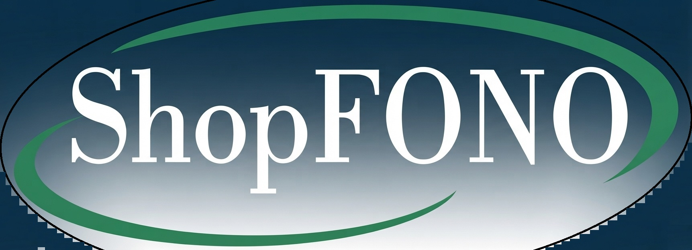

  

<h1 align="center">Extensor Caneta FORMA®</h1>

  <b>Manual de Instruções de Uso Multilíngue / Multilingual Instructions for Use / Manual de Instrucciones Multilingüe</b>

  <a href="docs/pt-BR/README.md"><b>🇧🇷 Português</b></a> &nbsp;•&nbsp;
  <a href="docs/en-US/README.md"><b>🇺🇸 English</b></a> &nbsp;•&nbsp;
  <a href="docs/es-ES/README.md"><b>🇪🇸 Español</b></a>

---

## 📌 Selecione seu Idioma / Select your Language / Seleccione su Idioma

* 🇧🇷 **[Português (Brasil)](docs/pt-BR/README.md)** — Manual de Instruções de Uso oficial (DOC 2 - Rev. 10).
* 🇺🇸 **[English](docs/en-US/README.md)** — Official Instructions for Use manual (DOC 2 - Rev. 10).
* 🇪🇸 **[Español](docs/es-ES/README.md)** — Manual de Instrucciones de Uso oficial (DOC 2 - Rev. 10).

---

## 📋 Informações do Documento / Document Information

| Campo / Field | Detalhe / Detail |
|---|---|
| **Produto / Product** | Extensor Caneta FORMA® |
| **Código / Document Code** | DOC 2 |
| **Revisão / Revision** | 10 |
| **Notificação ANVISA / ANVISA Reg.** | 81379320001 |
| **Fabricante / Manufacturer** | Shopfono Comércio de Produtos de Saúde LTDA |

---

## 🔬 Sobre o Produto / About the Product

O **Extensor Caneta FORMA®** é um acessório de precisão desenvolvido para ser utilizado acoplado a equipamentos de Eletroestimulação Neuromuscular (EENM). Projetado para administração em regiões extra e intraorais, ele permite a realização de estimulação neuromuscular em pontos motores com segurança, ergonomia e higiene.

### Áreas de Aplicação
* 🗣️ **Fonoaudiologia** (Motricidade Orofacial, Disfagia, Estética Facial)
* 🏋️ **Fisioterapia**
* 🦷 **Odontologia**
* 💆 **Estética**

---

## 📞 Atendimento ao Consumidor / Customer Support

- **Telefone / WhatsApp**: (44) 99809-9107
- **E-mail**: [contato@shopfono.com.br](mailto:contato@shopfono.com.br)
- **Fabricante Legal**: Shopfono Comércio de Produtos de Saúde LTDA
- **Endereço**: Rua das Azaleias, 323 - Bairro Conj. Hab. Inocente Vila Nova Júnior, Maringá - PR, CEP: 87060-040

---
© Shopfono Comércio de Produtos de Saúde LTDA. Todos os direitos reservados.
